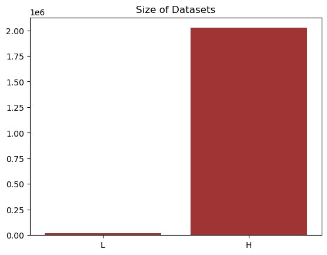
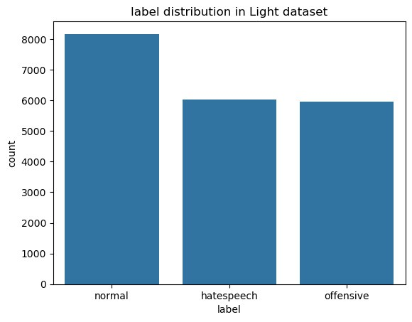
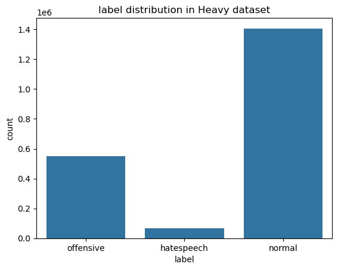
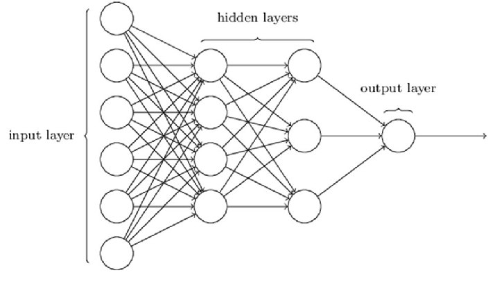
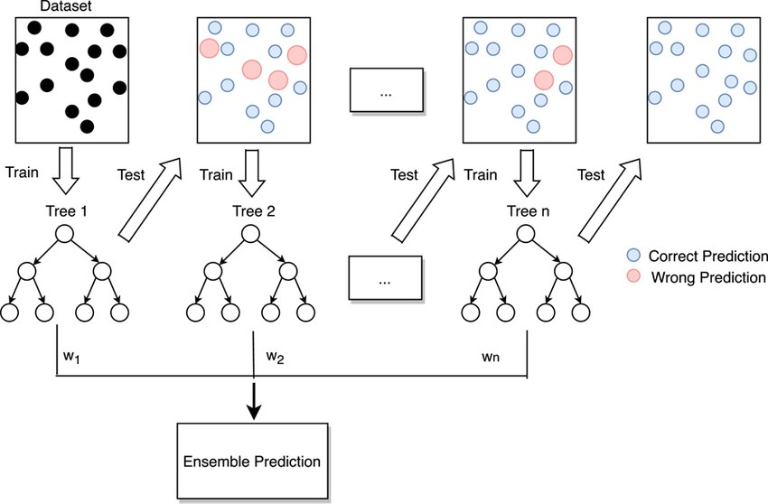
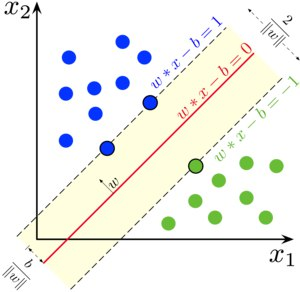
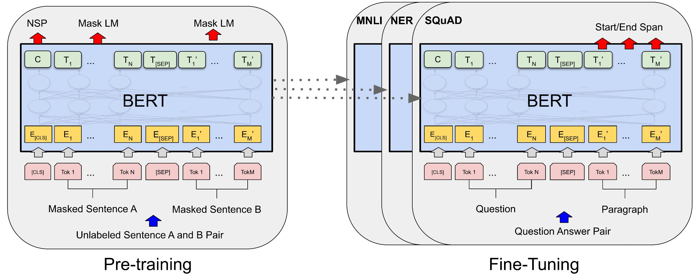
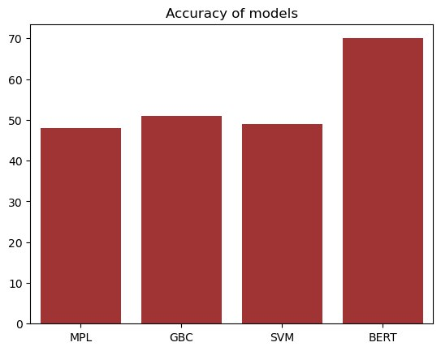

# NOTE: larger files, including datasets and model weights, are housed on [Google Drive](https://drive.google.com/drive/folders/14nzDT1nva1aNvQ5VoHZnZd-YZccn8ymx?usp=sharing)

# 2024_TikTokTechJam--blin--project
This a repository housing the solution for 2024 Tik-Tok Tech Jam, on "Preventing hate speech". Teamname &lt;blin>
### Challenge 

 The internet has connected people through platforms that enable information
  exchange. To prevent hate and offensive speech, most platforms have
    community guidelines, moderation teams, and monitoring techniques. TikTok,
    for example, classifies content as restrictible (inappropriate for youth) or
    removable (violating policies).     
Our goal is to create an AI-powered solution
    that effectively classifies content as normal, offensive, or hate speech. A
    key challenge is accurately identifying and categorizing text per TikTok's
    hate speech policy. The complexity of natural language, including sarcasm,
    slang, and cultural references, complicates this task.

### Data Processing
Our team began by taking multiple initial datasets of comments with three varying classification criteria for comments of similar nature. The datasets were combined where data preparation and validation were performed to standardize all data entries into one form, removing any junk symbols or unsuitable entries to  leave a homogenous list of text comments.

    

    
    

Each entry was labelled in a systematic manner, using numerical values to represent each category, where the number 0, 1 and 2 represented normal, offensive and hate speech respectively. 

<left>
    

    
    

</left>
<right>
    

    
    

</right>

The research component consisted of using classical machine learning algorithms, for which we employed a light dataset model consisting of 20 thousand entries. The production component centred around a deep learning algorithm using a heavy dataset model of over 2 million entries.

### Classical Machine Learning
To ascertain the best type of machine algorithm to utilise in production, a light dataset was used to train various learning models such as multilayer perceptron neural network, gradient booster classifier and support vector machine. The research was focused mainly on assessing the accuracy and f1 score of the models, however all models yielded unsatisfactory results with scores averaging around 50% across all models. It hence became evident that a more sophisticated algorithm, such as deep learning, was necessitated to attain the desired quality of results.

<left>
    

    
    

</left>

    

    
    

<right>
    

    
    

</right>

### Deep Learning
To implement the deep learning algorithm, a BERT model was selected because of it being a bidirectional model, which tends to capture more of the text’s context and meaning. 

    

    
    

Initial tests on light datasets showed results of 65-70%, so we concluded that a heavy dataset would be capable of producing results up to 90%, however our personal machines lacked sufficient computing power to support the training of such a model on a large number of dataset entries such as ours. Despite this, we are confident that training with a larger dataset, would allow the algorithm to more accurately differentiate between various classifications of comments, and recognise linguistic elements such as sarcasm, slang, and cultural references.

### Website
We have also developed a web-site using basic web development stack, such as Node.js, Express.js and EJS, which would be used to upload video files or comments to make prediction whether or not they contain hatespeech. You can access the website [here](), or by scanning the QR code:

    

    
    

### Conclusion
In the process of our research, we have successfully created a BERT model algorithm, with demonstrated capabilities to achieve an accuracy up to 70% in language and text classification. We have also developed a prototype of a website, that ideally, upon full functionality would be able to load videos from Tik-Toc and classify them in a similar manner without loss of accuracy.

### References
~~~bibtex

@inproceedings{mathew2021hatexplain,
  title={HateXplain: A Benchmark Dataset for Explainable Hate Speech Detection},
  author={Mathew, Binny and Saha, Punyajoy and Yimam, Seid Muhie and Biemann, Chris and Goyal, Pawan and Mukherjee, Animesh},
  booktitle={Proceedings of the AAAI Conference on Artificial Intelligence},
  volume={35},
  number={17},
  pages={14867--14875},
  year={2021}
},

@inproceedings{hateoffensive,
  title = {Automated Hate Speech Detection and the Problem of Offensive Language},
  author = {Davidson, Thomas and Warmsley, Dana and Macy, Michael and Weber, Ingmar}, 
  booktitle = {Proceedings of the 11th International AAAI Conference on Web and Social Media},
  series = {ICWSM '17},
  year = {2017},
  location = {Montreal, Canada},
  pages = {512-515}
  },

title = civil_comments
website = https://www.tensorflow.org/datasets/catalog/civil_comments#civil_commentscivilcomments_default_config
~~~
